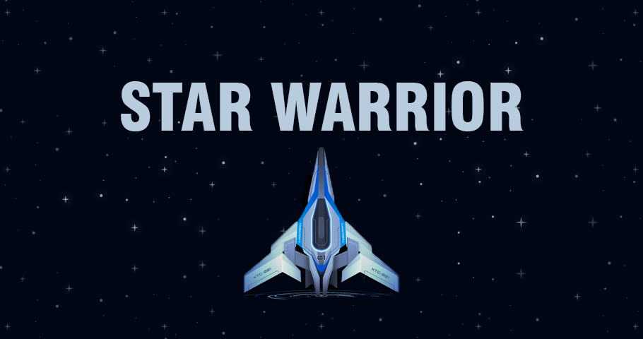

# Star Warrior

This is an arcade unity game about shooting bad guys in space.
I got the sprites from [this course from Udemy](https://www.udemy.com/course/the-ultimate-guide-to-game-development-with-unity/).

This is my final showcase for advanced unity course in Iran Game Development Institute.
New things I used from this project:

 - Singletons
 - Observer Pattern
 - Raycasts
 - Shaders
 - Particles
 - Object Pools
 - Animation States
 - GUI Layouts
 - Optimization and Release
